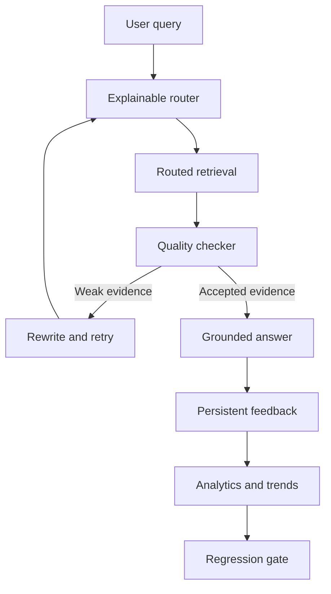

# FleetMind-RAG

FleetMind-RAG is a local-first, citation-grounded assistant for fleet
operations and technical-document support. It combines deterministic query
routing, dense and sparse retrieval, adaptive retry, LangGraph orchestration,
and persistent feedback analytics.

> **Project status:** The core adaptive RAG and feedback-control pipeline is
> implemented and tested. Current work focuses on operational documentation,
> release readiness, and later API and deployment layers.

## Capabilities

- Ingest sectioned fleet manuals into persistent local Qdrant storage.
- Retrieve evidence with dense, BM25 sparse, hybrid RRF, or transparent
  reranked search.
- Route each query using explainable lexical, conceptual, safety, and
  complexity signals.
- Check retrieval quality and deterministically rewrite weak queries.
- Coordinate bounded retrieve-assess-rewrite loops with LangGraph.
- Produce citation-grounded answers or safely abstain when evidence is weak.
- Persist immutable routing-feedback observations in versioned JSON.
- Report aggregate strategy and feature performance.
- Compare chronological feedback windows for improving, stable, regressing,
  or insufficient-data trends.
- Enforce regression gates locally and in GitHub Actions.

## Architecture



See [`docs/architecture.md`](docs/architecture.md) for component boundaries and
data flow.

## Technology

| Area | Current technology |
| --- | --- |
| Language | Python 3.12 |
| Dependency management | uv |
| Local LLM and embeddings | Ollama |
| Agent orchestration | LangGraph |
| Vector storage | Qdrant local mode |
| Configuration | pydantic-settings |
| Testing and coverage | pytest, pytest-cov |
| Formatting and linting | Ruff |
| Static typing | strict mypy |
| Continuous integration | GitHub Actions |

FastAPI, container deployment, fleet-system tool calls, and human-approval
interfaces remain future work.

## Quick Start

### Prerequisites

Install:

- Git
- Python 3.12
- uv
- Ollama

Clone and synchronize the locked environment:

```powershell
git clone https://github.com/mazyartaghavi/fleetmind-rag.git
Set-Location fleetmind-rag
uv python install 3.12
uv sync --locked
```

Create local configuration:

```powershell
Copy-Item .env.example .env
```

Start Ollama and obtain the configured models:

```powershell
ollama pull llama3.2:3b
ollama pull embeddinggemma
ollama list
```

Check FleetMind configuration and Ollama availability:

```powershell
uv run fleetmind-rag
```

## Index a Document

The repository includes a small evaluation manual:

```powershell
uv run fleetmind-rag index `
    evaluation/data/fleet_manual.md `
    --recreate
```

`--recreate` rebuilds the configured collection. Use it deliberately because
existing indexed chunks are replaced.

## Ask Questions

Run the established grounded-answer path:

```powershell
uv run fleetmind-rag ask `
    "What should the driver do if a battery warning appears with smoke?" `
    --limit 5
```

Run adaptive retrieval with bounded rewrite and retry:

```powershell
uv run fleetmind-rag ask `
    "What should the driver do if a battery warning appears with smoke?" `
    --adaptive `
    --limit 5 `
    --max-attempts 3 `
    --candidate-limit 20
```

Adaptive output reports workflow status, attempt count, rewrite count, initial
and final strategies, and persisted feedback revision.

## Feedback Operations

Summarize the persistent feedback history:

```powershell
uv run fleetmind-rag feedback-report
```

Compare the newest feedback window with the preceding window:

```powershell
uv run fleetmind-rag feedback-trend `
    --window-size 10 `
    --minimum-change 0.05 `
    --minimum-strategy-observations 2
```

Run the operational regression gate:

```powershell
uv run fleetmind-rag feedback-gate `
    --format json `
    --fail-on fail
```

Gate exit codes are stable:

| Code | Meaning |
| ---: | --- |
| 0 | Gate passed, or the selected enforcement mode permits the status |
| 1 | Configuration, storage, or execution error |
| 2 | Enforced warning, normally insufficient evidence |
| 3 | Enforced feedback regression |

The repository’s CI uses a synthetic snapshot:

```powershell
uv run fleetmind-rag feedback-gate `
    --feedback-path evaluation/data/routing_feedback_ci.json `
    --window-size 10 `
    --minimum-change 0.05 `
    --minimum-strategy-observations 2 `
    --format json `
    --fail-on warn
```

The synthetic snapshot is reproducible test evidence. It is separate from the
private runtime file under `data/qdrant_local`.

## Quality Gate

Run the same core checks used by GitHub Actions:

```powershell
uv lock --check
uv run ruff format --check .
uv run ruff check .
uv run mypy src tests
uv run pytest --cov=fleetmind_rag --cov-report=term-missing
```

The configured minimum total coverage is 80 percent.

## Safety Properties

FleetMind:

- grounds answers in retrieved document evidence;
- displays source references;
- validates generated answers and can use extractive fallback;
- abstains when evidence is not sufficient;
- handles permission-sensitive operational questions deterministically;
- keeps runtime feedback outside version control;
- bounds adaptive retry attempts;
- exposes routing, quality, trend, and gate decisions for inspection.

It is a decision-support prototype, not a substitute for authorized
technicians, fleet policy, emergency procedures, or professional safety
judgment.

## Repository Guide

```text
fleetmind-rag/
├── .github/workflows/ci.yml
├── docs/
│   ├── architecture.md
│   ├── development.md
│   └── operations.md
├── evaluation/data/
├── src/fleetmind_rag/
├── tests/
├── .env.example
├── pyproject.toml
└── uv.lock
```

- [`docs/development.md`](docs/development.md): environment, testing, and Git
  workflow.
- [`docs/architecture.md`](docs/architecture.md): modules and control flow.
- [`docs/operations.md`](docs/operations.md): runtime procedures, feedback,
  gates, recovery, and troubleshooting.

## License

FleetMind-RAG is licensed under the [MIT License](LICENSE).

## Author

**Mazyar Taghavi**

AI engineer and reinforcement-learning researcher working at the intersection
of reinforcement learning, generative AI, intelligent agents, and
mathematical optimization.
