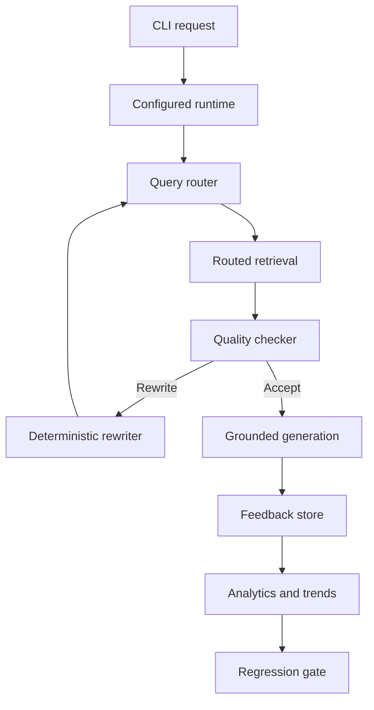
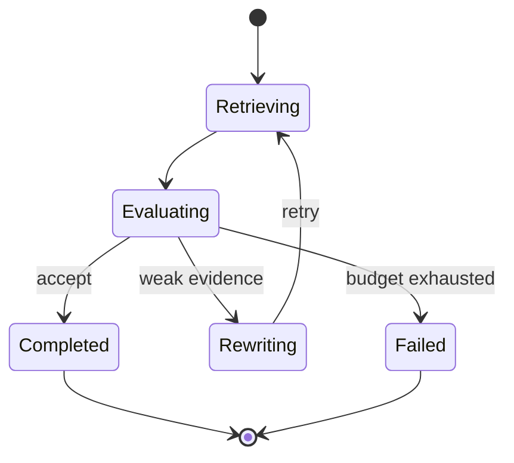

# Architecture

FleetMind-RAG separates deterministic retrieval control from provider-backed
embedding and generation. This keeps routing, quality checks, state
transitions, feedback analysis, and regression decisions reproducible and
testable without Ollama or Qdrant.

## End-to-End Flow

## Retrieval Strategies

| Strategy | Primary use |
| --- | --- |
| Dense | Conceptual semantic questions |
| Sparse | Exact identifiers, codes, and quoted phrases |
| Hybrid | Queries that benefit from semantic and lexical evidence |
| Reranked | Complex, conditional, operational, or safety-sensitive questions |

The router emits a complete `RoutingDecision` containing normalized signals,
all strategy scores, confidence, and an explanation. `RoutedRetrievalExecutor`
then calls the corresponding retrieval method while preserving the decision
with the result.

## Adaptive Retrieval State

`RetrievalAgentState` is immutable. Transitions record:

- original and current query;
- routed retrieval attempts;
- rewrite count and retry budget;
- lifecycle status;
- completion or failure reason;
- sequential audit history.

The LangGraph workflow has retrieve, assess, rewrite, complete, and fail
nodes. Conditional edges accept adequate evidence, rewrite weak evidence when
budget remains, or fail safely when the budget is exhausted.

## Retrieval Quality

The quality checker avoids comparing incompatible raw score scales from dense,
BM25, RRF, and reranked retrieval. Instead it evaluates explainable evidence:

- whether matches exist;
- whether scores are finite;
- meaningful query-token coverage;
- preservation of identifiers and quoted phrases;
- reranked lexical coverage where applicable.

Its verdict is either `accept` or `rewrite`, with individual signals, a quality
score, and human-readable reasons.

## Grounded Answers

Accepted routed evidence is adapted to the existing grounded-answer service.
The service preserves:

- bounded context construction;
- source labels and citations;
- deterministic permission handling;
- generation validation;
- extractive fallback;
- safe abstention.

If adaptive retrieval exhausts its budget, generation is skipped and the
system abstains.

## Feedback Control

Each adaptive run returns immutable observations containing query, strategy,
verdict, quality, attempt number, and query-signal features.

`JsonRoutingFeedbackStore` persists the complete history using:

- schema versioning;
- atomic file replacement;
- optimistic revision checks;
- cross-process locking;
- immutable loaded snapshots.

Feedback-aware routing groups observations by complete query-signal profile.
It applies bounded adjustments only after minimum evidence requirements are
met. Sparse safeguards for exact identifiers and reranked safeguards for
complex safety queries remain in force.

## Analytics, Trends, and Gates

Aggregate analytics report acceptance, rewriting, quality, and retry metrics
overall, by strategy, and by query feature.

Trend analysis compares adjacent chronological windows and classifies them as:

- `improving`
- `stable`
- `regressing`
- `insufficient_data`

The regression gate converts trends into:

- `pass`
- `warn`
- `fail`

It also supplies stable automation exit codes. GitHub Actions runs the gate
against a committed synthetic snapshot with strict warning enforcement.

## Persistence Boundaries

| Data | Location | Version controlled |
| --- | --- | --- |
| Qdrant collection | `data/qdrant_local/` | No |
| Runtime feedback | `data/qdrant_local/routing_feedback.json` | No |
| CI feedback fixture | `evaluation/data/routing_feedback_ci.json` | Yes |
| Evaluation cases | `evaluation/data/` | Yes |

The CI fixture tests deterministic gate behavior. It is not a copy of
production or personal runtime feedback.

## Current Boundaries

Implemented:

- local CLI;
- Ollama generation and embeddings;
- Qdrant local persistence;
- adaptive LangGraph retrieval;
- feedback-aware routing and operational gates;
- comprehensive automated quality checks.

Not yet implemented:

- FastAPI or web UI;
- authentication and authorization;
- container or cloud deployment;
- real telemetry and maintenance-system tools;
- human-approval UI;
- production observability and alert delivery;
- online contextual-bandit training.
